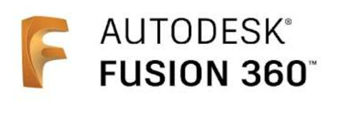
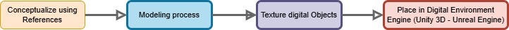

# **3D Digital Models**

## Objective  
Create 3D digital models to replicate familiar physical objects for integration into Virtual Reality and Augmented Reality environments as part of BCTI inmersive and digital projects.

## Context  

3D digital models are computer-generated graphics created using specialized 3D software. The process involves tools that manipulate faces, vertices, and polygons, using software such as Blender or Autodesk Fusion 360. These models form the backbone of virtual environments by accurately representing physical elements in digital formats.

## Software  

The 3D digital models used in testing were created with Autodesk Fusion 360, Maya and Blender, each software selected for specific tasks based on the project’s workflow methodology.  

- **Autodesk Fusion 360:**  
  As a comprehensive CAD, CAE, and CAM environment, this software was ideal for creating detailed digital objects. It was used to model complex items like the coupon dispenser, the online advisor module, and the EMA robot.  

  

- **Blender:**  
  Known for its versatility, Blender was used for modeling, animating, rendering, and texturing. It also supports exporting in various formats such as `.gltf`, `.glb`, `.dae`, and `.stl`, allowing flexibility across different platforms and scenarios. Blender is also used to make the retopology of the models to have a better topology mesh of the digital objects. 

  

## Workflow Methodology  

The development of 3D digital models followed these structured steps:  

1. **Conceptualization:**  
   Sketch the object to be modeled, using reference materials like photographs, images, or drawings to define the geometry, textures, and colors of the object.  

2. **Modeling:**  
   Define the polygonal complexity of the models—either low-poly (low polygon count) for lightweight scenes or high-poly for detailed environments. This decision shapes the visual style of the virtual environment.  

3. **Texturing:**  
   Apply colors, textures, and finishes to the digital model to define its appearance in the virtual environment.  

4. **Exporting:**  
   Choose the appropriate file format for the model, such as `.obj`, `.fbx`, `.dae`, `.glb`, or `.gltf`. Note that formats like `.fbx`, `.gltf`, and `.glb` preserve texture information.  

   

## Results  

The 3D digital models successfully met the objectives for Virtual Reality and Augmented Reality experiments conducted within the digital reality experimentation framework.  

## Conclusions  

- Low-poly models should have a polygon count of 2,000 or fewer to ensure virtual scenes remain lightweight and maintain a high level of user experience fidelity.  
- High-quality 3D digital models with accurate textures and strong resemblance to real-world objects are essential for implementing Virtual Reality and Augmented Reality technologies. Such models enhance realism and improve user immersion in digital environments.  
